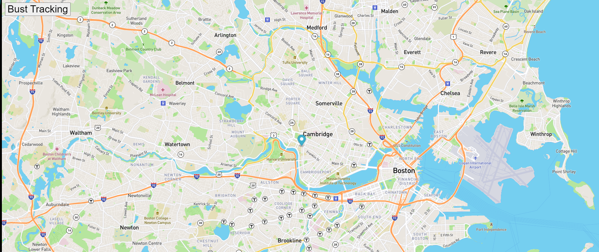

# RealTime-Bus-Tracking-Exercise
This is a homework assignment for MIT xPro web-development-javascript. 
In this exercise we create map and get bus schedule information from an API
to track a bus schedule. We practiced how get information using APIs and updating maps. 

# Roadmap
This project has three files: Index.html, mapanimation.js, styles.css. Download these three files to a folder in your computer. Drag and drop the index file into your browser. The marker is poing the bus that we are tracking. If you open the console you will see that the position of the bus is updating according to settimeout function.

I will add more busses to track in a specific area like Camridge. 

<a href="https://github.com/hicranA/RealTime-Bus-Tracking-Excersize">Real Time Bus Tracker Repo</a> 
<a href= "https://hicrana.github.io/RealTime-Bus-Tracking-Excersize/"> Real Time Bus Tracker</a>  

